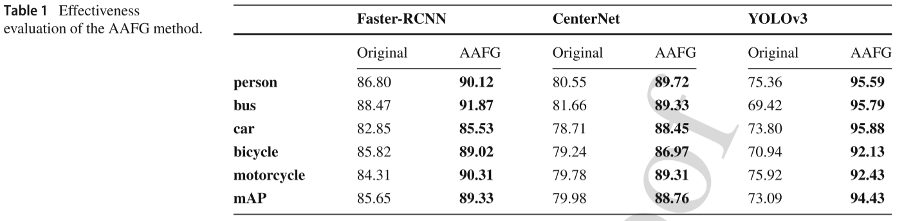
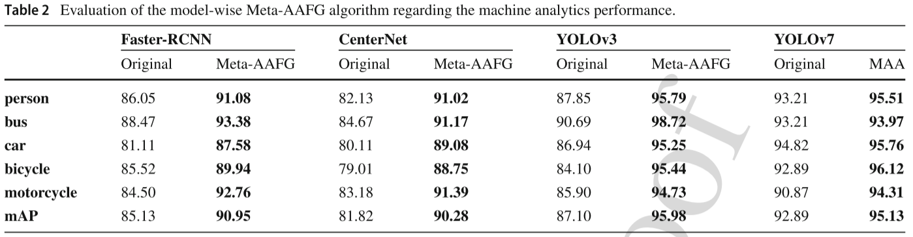

# Towards Generalized Image Coding for Machine Through Meta Adversarial Adaptation

This repo contains the official PyTorch implementation for the paper "Towards Generalized Image Coding for Machine Through Meta Adversarial Adaptation", published in **International Journal of Computer Vision (IJCV 2026)**.

## Updates

**Latest**
The code and pretrained models are released.

**2026/01/01**
*Towards Generalized Image Coding for Machine Through Meta Adversarial Adaptation* is accepted at **IJCV 2026**!

## Abstract

The existing Image Coding for Machine (ICM) paradigm aims at simultaneously fulfilling both machine analytics and human perception needs by incorporating the performance constraint of downstream machine vision models. However, the intrinsic semantic gap among different vision tasks and the reliance on the performance of specific models pose flexibility and generalization issues when handling unseen scenarios. To this challenge, this paper introduces a novel ICM paradigm that imposes an additional constraint on the reconstructed image from the **Meta-Adversarial-Adaptation (MAA)** perspective. 
Extensive experimental results have demonstrated the effectiveness of our design in achieving satisfactory perceptual quality, improved machine analytics performance, and powerful generalization capacity regarding unseen downstream models, image domains, and object-centric tasks.

<!-- 请将你的框架图命名为 framework.png 并放在 img 文件夹下 -->
<div align="center">
  
</div>

<div align="center">
  
</div>

## Environment

*   Python 3.8
*   PyTorch 1.10.2
*   CompressAI 1.2.4
*   CUDA 11.3

## 📂 Code Structure & Functionality

This repository implements three levels of adversarial adaptation strategies corresponding to the paper:

| Script | Algorithm | Functionality |
| :--- | :--- | :--- |
| `aafg_demo.py` | **Vanilla AAFG** | Optimizes images using a **single** downstream model (YOLO). |
| `meta_aafg_demo.py` | **Model-wise Meta-AAFG** | Optimizes images using a **Model Set** (YOLO + Faster-RCNN + CenterNet) via meta-learning to achieve cross-model generalization. |
| `metadomain_aafg_demo.py` | **Domain-wise Meta-AAFG** | Optimizes images using models trained on different domains (VOC & COCO) to achieve cross-domain generalization. |

## 🚀 Usage

Since this project relies on specific dataset paths and pre-trained model weights, please follow the steps below to configure and run the scripts.

### 1. Preparation
Ensure you have the following files ready:
*   **Dataset List**: `.txt` files containing image paths (e.g., `new_trainvallist.txt` mentioned in the code).
*   **Pre-trained Weights**: Checkpoints for YOLO, Faster-RCNN, and CenterNet (e.g., `512logs/best_epoch_weights.pth`).
*   **Class Definitions**: `model_data/voc_classes.txt` or similar.

### 2. Configuration
**Note:** The paths are currently hardcoded in the scripts. Before running, please open the python files and modify the following variables to match your local environment:

*   `train_annotation_path`: Path to your dataset txt file.
*   `model_path` / `classes_path`: Paths to your pre-trained weights and class files.
*   `save_path`: Where you want to save the augmented images (e.g., `"hy8_512newattack_images/"`).

### 3. Running the Scripts

#### A. Generate AAFG Images (Single Model)
To generate standard adversarial augmented images:

```bash
python aafg_demo.py
```
This will read images using Attack_YoloDataset, apply AAFG, and save results to the configured output folder.

#### B. Generate Meta-AAFG Images (Cross-Model)
To generate images with strong generalization across different detectors:
```bash
python meta_aafg_demo.py
```
This script loads YOLO, FRCNN, and CenterNet simultaneously and performs the meta-learning optimization loop.

#### C. Generate Domain-wise Meta-AAFG Images (Cross-Domain)
To generate images with generalization across domains (VOC/COCO):
```bash
python metadomain_aafg_demo.py
```
This script loads 6 models (3 VOC-trained + 3 COCO-trained) to capture domain-invariant features.

## License:

## Acknowledgments:
This project is based on the following open-source works:
* CompressAI: InterDigitalInc/CompressAI
* YOLOv3: ultralytics/yolov3
* Faster-RCNN & CenterNet: Implementations based on standard PyTorch repositories.
* TorchAttacks: Structure inspired by Harry24k/adversarial-attacks-pytorch.

If you find this code useful, please cite our paper.
