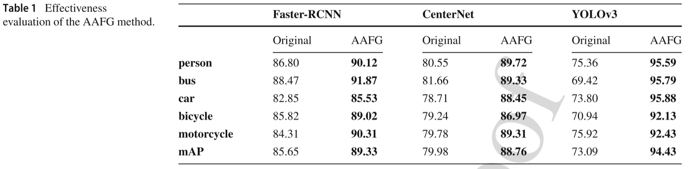
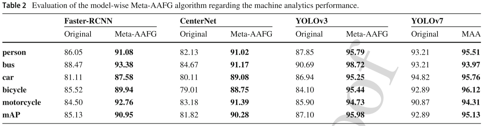

# Towards Generalized Image Coding for Machine Through Meta Adversarial Adaptation

This repo contains the official PyTorch implementation for the paper **"Towards Generalized Image Coding for Machine Through Meta Adversarial Adaptation"**, published in **International Journal of Computer Vision (IJCV 2026)**.

## Updates

**Latest**

- The code, pretrained models, generated adversarial images, and evaluation outputs are released.
- This release is research-oriented. Some paths and experiment settings are still kept in the original script files.

**2026/01/01**

- *Towards Generalized Image Coding for Machine Through Meta Adversarial Adaptation* is accepted at **IJCV 2026**.

## Abstract

The existing Image Coding for Machine (ICM) paradigm aims at simultaneously fulfilling both machine analytics and human perception needs by incorporating the performance constraint of downstream machine vision models. However, the intrinsic semantic gap among different vision tasks and the reliance on the performance of specific models pose flexibility and generalization issues when handling unseen scenarios. To this challenge, this paper introduces a novel ICM paradigm that imposes an additional constraint on the reconstructed image from the **Meta-Adversarial-Adaptation (MAA)** perspective.

Extensive experimental results have demonstrated the effectiveness of our design in achieving satisfactory perceptual quality, improved machine analytics performance, and powerful generalization capacity regarding unseen downstream models, image domains, and object-centric tasks.

<div align="center">
  
</div>

<div align="center">
  
</div>

## Environment

- Python 3.8
- PyTorch 1.10.2
- CUDA 11.3
- torchvision
- Pillow
- opencv-python
- numpy
- matplotlib
- tqdm
- torchattacks
- pycocotools (optional, only needed for COCO-style mAP evaluation)

The current repository does not provide `requirements.txt` or `environment.yml`. Please install the dependencies manually according to your CUDA and PyTorch versions.

```bash
pip install torchvision pillow opencv-python numpy matplotlib tqdm torchattacks
```

## Code Structure & Functionality

This repository implements three levels of adversarial adaptation strategies corresponding to the paper:

| Script | Algorithm | Functionality |
| :--- | :--- | :--- |
| `aafg_demo.py` | **Vanilla AAFG** | Optimizes images using a **single** downstream model (YOLO). |
| `meta_aafg_demo.py` | **Model-wise Meta-AAFG** | Optimizes images using a **model set** (YOLO + Faster R-CNN + CenterNet) via meta-learning to achieve cross-model generalization. |
| `metadomain_aafg_demo.py` | **Domain-wise Meta-AAFG** | Optimizes images using models trained on different domains (VOC & COCO) to achieve cross-domain generalization. |
| `get_map.py` | **Evaluation** | Generates detection results, ground-truth files, and mAP reports. |

The supporting modules are organized as follows:

- `aafg.py`, `meta_aafg.py`, `metadomain_aafg.py`: core attack implementations.
- `aafg_dataset.py`, `meta_aafg_dataloader.py`: dataloaders for attack generation.
- `models/`: detector wrappers for YOLO, Faster R-CNN, and CenterNet.
- `nets/`, `utils/`, `centernet_utils/`: network definitions, losses, bbox utilities, and mAP utilities.
- `model_data/`: class names, anchors, fonts, and several model-related assets.

## Released Assets

The repository currently contains VOC-style data and released experiment artifacts:

- `VOCdevkit/VOC2007/`: images and annotations in VOC-style layout.
- `new_trainvallist.txt`: training / validation list with `9759` samples.
- `new_testlist.txt`: test list with `1086` samples.
- `logs/best_epoch_weights.pth`: YOLO checkpoint used by the released workflows.
- `frcnn512logs/best_epoch_weights.pth`: Faster R-CNN checkpoint used by the released workflows.
- `cen512logs/best_epoch_weights.pth`: CenterNet checkpoint used by the released workflows.

Please download the released assets from:
```text
Checkpoints:https://pan.baidu.com/s/1fTUTyrAR3qBpQC4V_LZGUQ?pwd=d3y7 提取码: d3y7
```

## Usage

Since this project relies on specific dataset paths and pretrained model weights, please follow the steps below to configure and run the scripts.

### 1. Preparation

Ensure you have the following files ready:

- **Dataset list**: `.txt` files containing image paths and bounding boxes, such as `new_testlist.txt`.
- **VOC-style dataset**: images under `VOCdevkit/VOC2007/JPEGImages/` and annotations under `VOCdevkit/VOC2007/Annotations/`.
- **Pretrained weights**: checkpoints for YOLO, Faster R-CNN, and CenterNet.
- **Class definitions**: `model_data/voc_classes.txt` or another class file matching your checkpoint.

### 2. Configuration

Before running, open the corresponding Python script and check the following variables:

- `train_annotation_path`: path to the dataset list file.
- `classes_path`: path to the class definition file.
- `model_path`: path to the pretrained checkpoint.
- output directory: where generated adversarial images are saved.

### 3. Running the Scripts

#### A. Generate AAFG Images (Single Model)

```bash
python aafg_demo.py
```

This script reads images using `Attack_YoloDataset`, applies AAFG against YOLO, and saves results to the configured output folder. In the released script, the default output folder is:

```text
VOCattack_images/
```

#### B. Generate Meta-AAFG Images (Cross-Model)

```bash
python meta_aafg_demo.py
```

This script loads YOLO, Faster R-CNN, and CenterNet simultaneously and performs the meta-learning optimization loop. In the released script, the default output folder is:

```text
5class_metaAttack_image/
```

#### C. Generate Domain-wise Meta-AAFG Images (Cross-Domain)

```bash
python metadomain_aafg_demo.py
```

This script loads VOC- and COCO-trained detector groups to capture domain-invariant features. Please note that the current repository does **not** include all assets required to run this script out of the box. 
Please prepare these checkpoints and adjust paths before running the cross-domain experiment.

## Evaluation

To evaluate generated images with mAP:

```bash
python get_map.py
```

Before running, check the following settings in `get_map.py`:

- `map_mode`
- `classes_path`
- `model_path`
- `map_out_path`
- the image folder being evaluated, such as `VOCattack_images/` or `5class_metaAttack_image/`

The repository already includes several evaluation outputs. For example:

- `map_out_original/results/results.txt`: `mAP = 23.12%`
- `map_out_AAFG_5classImage/results/results.txt`: `mAP = 24.45%`

These bundled files are provided for reference and do not replace the full experimental results reported in the paper.

## Notes

- This is a research code release, not a fully packaged library.
- `AAFG` and `Meta-AAFG` are the main workflows in the current release.
- `MetaDomain-AAFG` requires additional COCO-domain checkpoints and path configuration.
- If you train or evaluate with a different class file, make sure the checkpoint, class list, and annotation class IDs are consistent.

## License

License: pending confirmation from the authors.

## Acknowledgments

This project is based on the following open-source works:

- CompressAI: InterDigitalInc/CompressAI
- YOLOv3 and related PyTorch implementations
- Faster R-CNN and CenterNet implementations based on standard PyTorch repositories
- TorchAttacks: structure inspired by Harry24k/adversarial-attacks-pytorch

If you find this code useful, please cite our paper. A formal BibTeX entry will be added once finalized by the authors.
